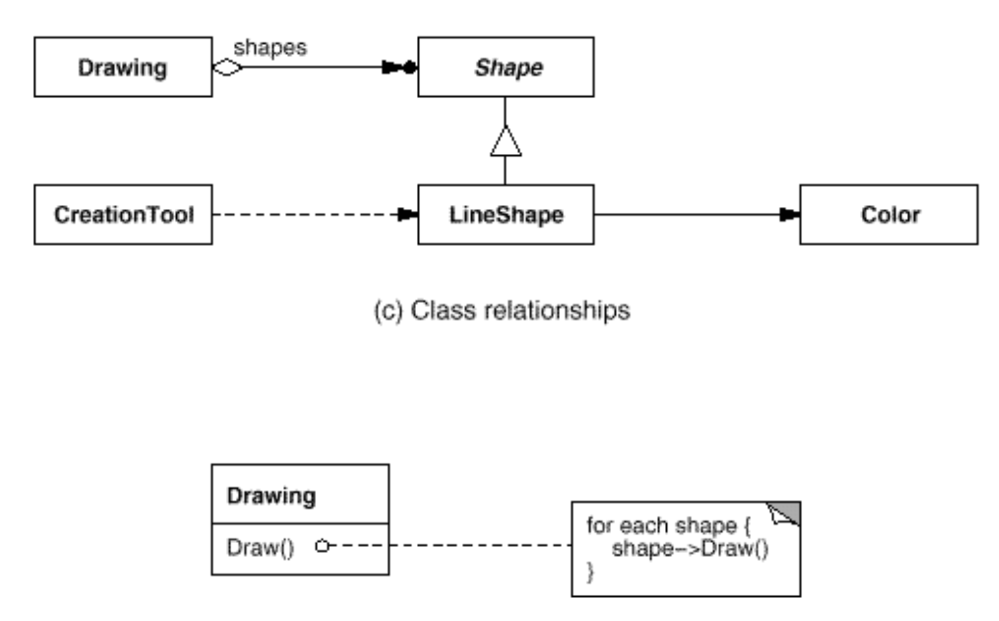
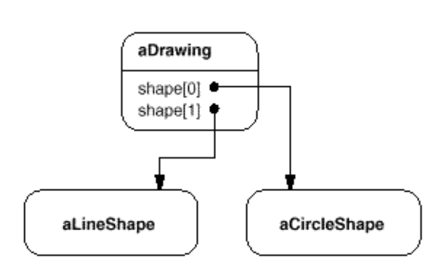
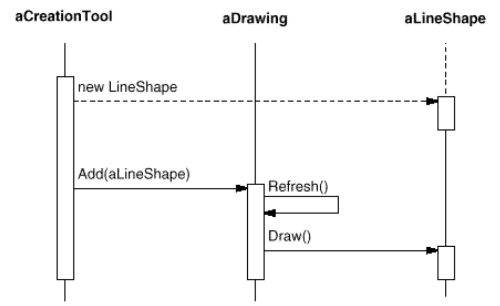

# Design Patterns (based on "Design Patterns: Elements of Reusable Object-Oriented Software")

## Intro

- `Design patterns` are the descriptions of communicating objects and classes that are customised to solve a general design problem in a particular context.
- `Object Modeling Technique` (OMT) is real world based modeling approach for software modeling and designing. It was developed basically as a method to develop object-oriented systems and to support object-oriented programming. It describes the static structure of the system.
[OMT](https://www.geeksforgeeks.org/software-engineering-object-modeling-technique-omt)

### Classification

1. By purpose:
- creational
- structural
- behavioural

2. By scope:
- patterns applied to classes (`via inheritance`, `static-fixed at compile-time`)
- patterns applied to objects (`via object relationships`, `run-time`)

The most of patterns are in the object scope.

3. Whether the patterns are used together, e.g., composite often used with iterator and visitor.

### Class inheritance vs Object composition

1. Class inheritance: 
- `white-box reuse`: the internals of parent classes are visible to subclasses (breaks encapsulation)
- defined at compile-time, inherited implementation cannot be changed at run-time
- allows for dynamic binding (`polymorphism: let's you substitute objects that have identical interfaces for each other at run-time`)
- makes it easier to modify the implementation being reused
- every change in parent would force the changes in children (inherit only from abstract classes!!)

2. Object composition:
- `black-box reuse`: no internal details of objects are visible (does not break encapsulation)
- assembling or composing objects to get more complex functionality
- defined dynamically at run-time via objects acquiring references to other objects

> `Program to an interface, not an implementation`. Do not declare variables to be instances of particular concrete classes. Instead, commit only to an interface defined by an abstract class. Use creational patterns for object instantiation.

`Delegation` is a process when an object delegates operations to its delegate. It makes it easy to compose behaviours at run-time and to change the way they are composed. `State`, `Strategy`, `Visitor` use delegation.

### Aggregation vs Acquaintance

`Aggregation` implies that one object owns or is responsible for another object (object is part of another object).
- strong coupling
- objects are resposible for each other te

`Acquaintance` (also, association) implies that an object only knows of another object (object is using another object). 
- weak coupling (mostly, created at run-time)
- objects are not resposible for each other
- more flexible but makes code difficult to read

> In C++, aggregation is implemented either by defining member variables that are real instances or (most commonly) as pointers or references to instances.

> In C++, acquantance is implemented with pointers and references.

> `Composite` and `Decorator` are useful in building complex run-time structures. `Observer` is used to build run-time structures but brings up the difficulty of code understanding.  

### Common causes of redesign

1. Creating an object by specifying a class explicitly. It commits us to a particular implementation instead of a particular interface.
- Solution: use `Abstract Factory`, `Factory`, `Prototype`.

2. Dependence on specific operations. It commits you to one way of satisfying a request. 
- Solution: use `Chain of Responsibility`, `Command`.

3. Dependence on hardware and software platform --> harder to port to other platforms.
- Solution: use `Abstract Factory`, `Bridge`.

4. Dependence on object representations or implementations --> clients might need to be changed when the object changes. Hiding information from clients keeps changes from cascading. 
- Solution: use `Abstract Factory`, `Bridge`, `Memento`, `Proxy`.

5. Algorithmic dependencies --> objects that depend on algorithms will have to change when an algorithm changes. 
- Solution: use `Builder`, `Iterator`, `Strategy`, `Visitor`.

6. Tight coupling --> makes classes hard to reuse in isolation. Leads to monolithic systems that are hard to reuse, learn, port, and modify.  
- Solution: use `Abstract Factory`, `Bridge`, `Chain of Responsibility`, `Command`, `Facade`, `Mediator`, `Observer`.

7. Extending functionality by subclassing --> can lead to explosion of classes.
- Solution: use `Bridge`, `Chain of Responsibility`, `Composite`, `Decorator`, `Observer`, `Strategy`.

8. Inability to alter classes conveniently --> e.g., by using commercial libraries, etc.
- Solution: use `Adaptor`, `Decorator`, `Visitor`.

## OMT Notation (customised)

### Kinds of relationship

Consider the differences and similarities between the classes of the following objects: pets, dogs, tails, owners.

- owners feed pets, pets please owners (`association`)
- a tail is a part of both dogs and cats (`aggregation / composition`)
- a cat is a kind of pet (`inheritance / generalization`)

> Aggregation and Composition are subsets of association meaning they are specific cases of association. In both aggregation and composition object of one class "owns" object of another class. But there is a subtle difference:

> `Aggregation implies a relationship where the child can exist independently of the parent`. Example: Class (parent) and Student (child). Delete the Class and the Students still exist.
> `Composition implies a relationship where the child cannot exist independent of the parent`. Example: House (parent) and Room (child). Rooms don't exist separate to a House.

[UML reference](https://www.visual-paradigm.com/guide/uml-unified-modeling-language/uml-aggregation-vs-composition/)

### Class relationship

1. `An object reference representing a part-of or aggregation relationship`:
- is indicated by an arrow headed line with a diamond at the base
- the arrow points to the class that is aggregated (e.g., Shape)
- an arrow headed line without the diamond denotes acquaintance (e.g., a LineShape keeps a reference to a Color object, which other shapes may share). 
- a name for the reference may appear near the base to distinguish it from other references

2. `Which classes instantiate which others` (the "creates" relationship)
- a dashed arrowheaded line is used to indicate this (OMT doesn't natively support it)
- the arrow points to the class that's instantiated. (e.g., CreationTool creates LineShape objects).

3. `More than one relationship` 
- is denoted by a filled circle 
- when the circle appears at the head of a reference, it means multiple objects are being referenced or aggregated (e.g., Drawing aggregates multiple objects of type Shape).

### Object relationship

- an object diagram shows instances exclusively
- it provides a snapshot of the objects in a design pattern
- the objects are named "aSomething", where Something is the class of the object. 
- our symbol for an object (modified slightly from standard OMT) is a rounded box with a line separating the object name from any object references. 
- arrows indicate the object referenced.

### Interaction relationship

- an interaction diagram shows the order in which requests between objects get executed
- below is an interaction diagram that shows how a shape gets added to a drawing.
- time flows from top to bottom in an interaction diagram. 
- a solid vertical line indicates the lifetime of a particular object. 
- the naming convention for objects is the same as for object diagrams — the class name prefixed by the letter "a" (e.g., aShape). 
- if the object doesn't get instantiated until after the beginning of time as recorded in the diagram, then its vertical line appears dashed until the pointof creation.
- a vertical rectangle shows that an object is active; that is, it is handling a request. The operation can send requests to other objects; these are indicated with a horizontal arrow pointing to the receiving object. 
- the name of the request is shown above the arrow. 
- a request to create an object is shown with a dashed arrowheaded line. 
- a request to the sending object itself points back to the sender.
- example below shows that the first request is from aCreationTool to create aLineShape. Later, aLineShape is Added to aDrawing, which prompts aDrawing to send a Refresh request to itself. Note that aDrawing sends a Draw request to aLineShape as part of the Refresh operation.

## MVC (Model/View/Controller)

1. Model: 
- application object
- contains application's data

2. View: 
- model object's screen representation
- ensures that appearence reflects the state of the model
- can be nested

3. Controller:
- defined how user interface reacts to an input

This pattern works on the basis of `Observer pattern`:
- model notifies the view about the change of its state
- view updates itself in response

Views can be nested (`Composite pattern`):
- CompositeView class is a subclass of View
- CompositeView objects act like View objects but it also manages nested View objects
- Controllers also can have hierarchies based on how they response to the different kind of user inputs

The View-Controller relationship use `Strategy pattern`:
- a view uses an instance of a Controller subclass to implement a particular response strategy
- to implement different strategy, replace the instance with a different kind of controller

## Memento

- describes how to encapsulate and save the internal state of an object so that the object can be restored to that state later

## Creational Patterns

- abstract the instantiation process
- help to make a system independent of how its objects are created, composed, and represented
- `class creational patterns` use inheritance to vary the class that is instantiated
- `object creational patterns` delegate instantiation to another object
- become inportant as system evolve to depend more on object composition than class inheritance
- they shif the emphasis away from hard-coding a fixed set of behaviours towards defining a smaller set of fundamental behaviours that can be composed into any number of more complex ones. 
- 2 recurring themes:
    - 1) creational patterns all encapsulate knowledge about which concrete classes the system uses
    - 2) hide how instances of these classes are created and put together (`all the system knows about the objects is their interfaces`) -->
- give a lot of flexibility for the instantiation process