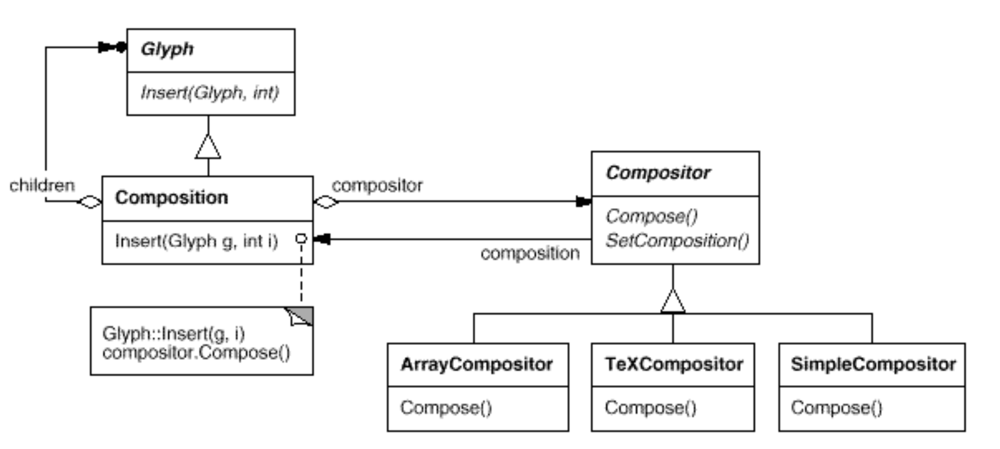

# Composite

- alllows to create a class hierarchy in which some subclasses define primitive objects (e.g., Button) and other classes define composite objects (CompositeView) that assemble primitives into more complex objects.

- usually consists of 
    - `Compositor` - a class for parent object that does a composition (or a base class from which different compositors are derrived) 
    - `Composition` - a class for parent that is being composed (or a base class from which different composed classes are derrived)

