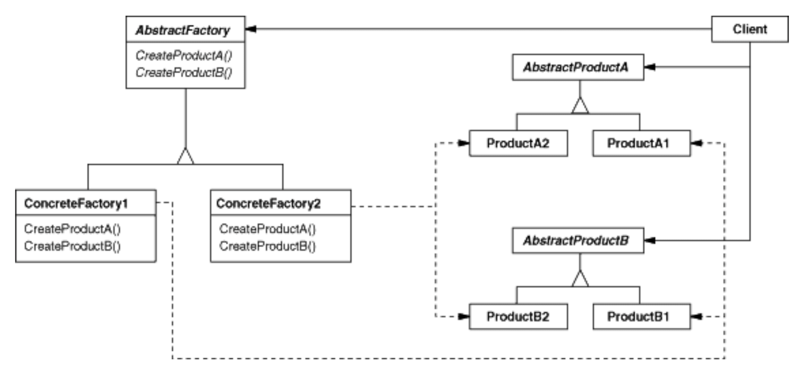

# Abstract Factory (KIT)

## Application

Use the Abstract Factory pattern when
- a system should be independent of how its products are created, composed, and represented.
- a system should be configured with one of multiple families of products.
- a family of related product objects is designed to be used together, and
you need to enforce this constraint.
- you want to provide a class library of products, and you want to reveal just their interfaces, not their implementations.

> Often used when UI needs to support multiple look-and-feel standards (common appearance for various UI elements). 

- clients create objects solely through the factory interface and have no knowledge of the classes that implement objects for a particular product or look-and-feel.

## Participants

1. `AbstractFactory`
- declares an interface for operations that create abstract product objects

2. `ConcreteFactory`
- implements the operations to create concrete product objects

3. `AbstractProduct`
- declares an interface for a type of a product object

4. `ConcreteProduct`
- defines a product object to be created by the corresponding concrete factory
- implements the AbstractProduct interface

5. `Client`
- uses only interfaces declared by AbstractFactory and AbstractProduct classes.

Normally a single instance of a `ConcreteFactory` class is created at run-time. This concrete factory creates product objects having a particular implementation. To create different product objects, clients should use a different concrete factory.

`AbstractFactory` defers creation of product objects to its ConcreteFactory subclass.

## Benefits

1. Isolates concrete classes: 
- a factory encapsulates the responsibility and the process of creating product objects 
- clients manipulate instances through their abstract interfaces
- product class names are isolated in the implementation of the concrete factory; they do not appear in client code.

2. Makes exchanging product families easy
- the class of a concrete factory appears only once in an application --> easy to change
- because an abstract factory creates a complete family of products, the whole product family changes at once
- promotes consistency among products

## Implementation

1. `Factories as singletons`. 
- an application typically needs only one instance of a ConcreteFactory per product family.

2. `Creating the products`.
- AbstractFactory only declares an interface for creating products
- only ConcreteProduct subclasses actually create products
- most common way is to define a factory method for each product
- ConcreteFactory will specify its products by overriding the factory method for each product -->
- requires a new concrete factory subclass for each product family, even if the product families differ only slightly.

> If many product families are possible, the concrete factory can be implemented using the `Prototype pattern`. The concrete factory is initialised with a prototypical instance of each product in the family, and it creates a new product by cloning its prototype. The Prototype-based approach eliminates the need for a new concrete factory class for each new product family.

3. `Defining extensible factories`.
- AbstractFactory usually defines a different operation for each kind of product it can produce
- the kinds of products are encoded in the operation signatures 
- adding a new kind of product requires changing the AbstractFactory interface and all the classes that depend on it.

> A more flexible but less safe design is to `add a parameter to operations that create objects`. This parameter specifies the kind of object to be created. It could be a class identifier, an integer, a string, or anything else that identifies the kind of product. With this approach, AbstractFactory only needs a single "Make" operation with a parameter indicating the kind of object to create. This is the technique used in the Prototype- and the class-based abstract factories. It is easier to use in a dynamically typed languages

