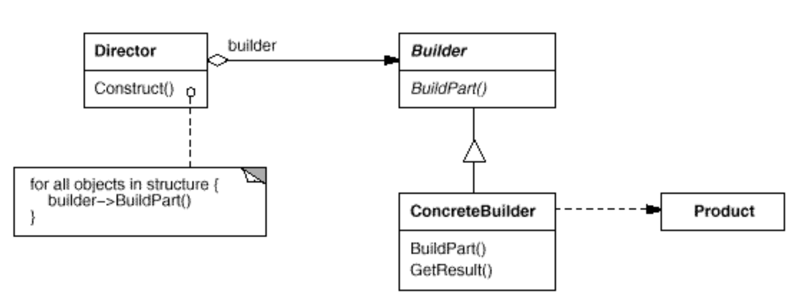
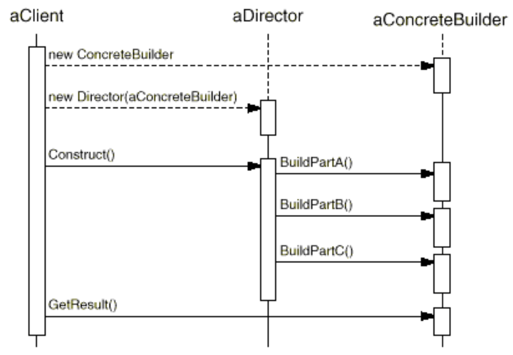

# Builder

## Application

Use the Builder pattern when
- the algorithm for creating a complex object should be independent of the parts that make up the object and how they're assembled.
- the construction process must allow different representations for the object that's constructed.

## Participants

1. `Builder`
- specifies an abstract interface for operations that create parts of abstract product objects

2. `ConcreteBuilder`
- constructs and assembles parts of the product by implementing the Builder interface
- defines and keeps track of the representation it creates
- provides an interface for retrieving the product

3. `Director`
- constructs an object using the Builder interface

4. `Product`
- represents the complex object under construction. `ConcreteBuilder` builds the product's internal representation and defines the process by which it's assembled.
- includes classes that define the constituent parts, including interfaces for assembling the parts into the final result.

## Mechanism

- the client creates the `Director object` and configures it with the desired `Builder object`
- Director notifies the builder whenever a part of the product should be built
- Builder handles requests from the director and adds parts to the product
- the client retrieves the product from the builder.

## Benefits

1. It lets you vary a product's internal representation:
- the builder object provides the director with abstract interface for constructing the product
- the interface lets builder hide the representation and internal structure of the product
- all you have to do to change the product's internal representation is define a new kind of builder.

2. It isolates code for construction and representation:
- encapsulates the way a complex object is constructed and represented
- clients needn't know anything about the classes that define the product's internal structure, and such classes don't appear in Builder's interface
- each ConcreteBuilder contains all the code to create and assemble a particular kind of product
- the code is written once, and then different Directors can reuse it to build Product variants from the same set of parts.

3. It gives you finer control over the construction process:
- the product gets constructed step by step under the director's control
- only when the product is finished does the director retrieve it from the builder.

> Builder solves what is known as `telescopic constructor` anti-pattern: a pattern, when an object can be constructed using many different constructors with various parameters. 

> The purpose of Builder: set only necessary fields in some object and keep remaining fields set to default values (!!). Presence of reasonable defaults for remaining fields is very important.

## Implementation

Typically there's an `abstract Builder class` that defines an operation for each component that a director may ask it to create. The operations do nothing by default. A `ConcreteBuilder class` overrides operations for components it's interested in creating.

## TODO

- Fluent Builder
- builder with callbacks (is it possible in C++?)