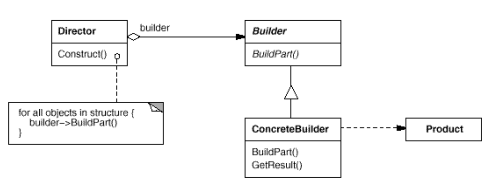

# Factory (aka Virtual Constructor)

# Builder

## Application

Use the Factory pattern when
- a class can't anticipate the class of objects it must create
- a class wants its subclasses to specify the objects it creates
- classes delegate responsibility to one of several helper subclasses, and you want to localise the knowledge of which helper subclass is the delegate.

## Participants

1. `Builder`
- specifies an abstract interface for operations that create parts of abstract product objects

2. `ConcreteBuilder`
- constructs and assembles parts of the product by implementing the Builder interface
- defines and keeps track of the representation it creates
- provides an interface for retrieving the product

3. `Director`
- constructs an object using the Builder interface

4. `Product`
- represents the complex object under construction. `ConcreteBuilder` builds the product's internal representation and defines the process by which it's assembled.
- includes classes that define the constituent parts, including interfaces for assembling the parts into the final result.

## Mechanism

- the client creates the `Director object` and configures it with the desired `Builder object`
- Director notifies the builder whenever a part of the product should be built
- Builder handles requests from the director and adds parts to the product
- the client retrieves the product from the builder.

## Benefits

1. It eliminate the need to bind application-specific classes into your code:
- the code only deals with the Product interface
- --> it can work with any user-defined ConcreteProduct classes.

2. It provides hooks for subclasses:
- creating objects inside a class with a factory method is always more flexible than creating an object directly
- Factory Method gives subclasses a hook for providing an extended version of an object.

3. It connects parallel class hierarchies:
- the factory method defines the connection between the two class hierarchies
- it localises knowledge of which classes belong together.

## Implementation

Typically there's an `abstract Builder class` that defines an operation for each component that a director may ask it to create. The operations do nothing by default. A `ConcreteBuilder class` overrides operations for components it's interested in creating.