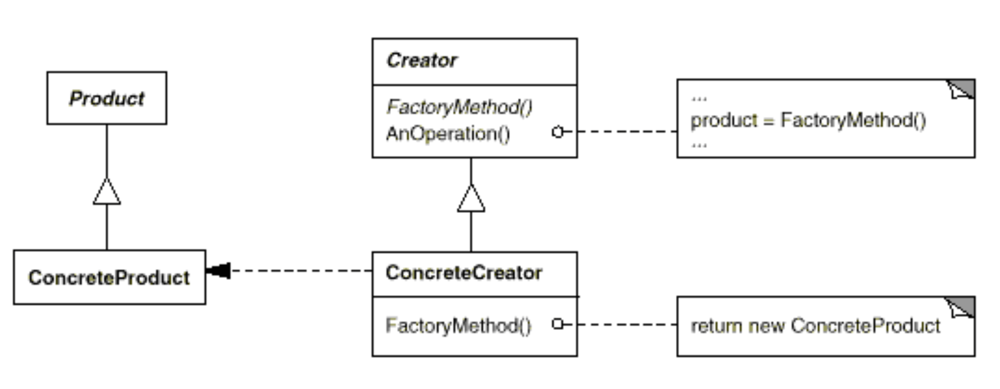

# Factory (aka Virtual Constructor)

## Application

Use the Factory pattern when
- a class can't anticipate the class of objects it must create
- a class wants its subclasses to specify the objects it creates
- classes delegate responsibility to one of several helper subclasses, and you want to localise the knowledge of which helper subclass is the delegate.

## Participants

1. `Product`
- specifies an interface of objects the factory method creates

2. `ConcreteProduct`
- implements the Product interface

3. `Creator`
- declares the factory method,which returns an object of type Product.
- Creator may also define a default implementation of the factory method that returns a default ConcreteProduct object
- it may call the factory method to create a Product object.

4. `ConcreteCreator`
- overrides the factory method to return an instance of a ConcreteProduct.

## Benefits

1. It eliminate the need to bind application-specific classes into your code:
- the code only deals with the Product interface
- --> it can work with any user-defined ConcreteProduct classes.

2. It provides hooks for subclasses:
- creating objects inside a class with a factory method is always more flexible than creating an object directly
- `Factory Method gives subclasses a hook for providing an extended version of an object`.

3. It connects parallel class hierarchies:
- the factory method defines the connection between the two class hierarchies
- it localises knowledge of which classes belong together.

> Factory methods are common in toolkits and frameworks.

## Implementation

1. Case 1: the `Creator class is an abstract class and does not provide an implementation for the factory method` it declares:

- there is no reasonable default --> requires subclasses to define an implementation
- but there is no need to instantiate unforseeable classes

2. Case 2: the `Creator is a concrete class and provides a default implementation for the factory method`:

- the concrete Creator uses the factory method primarily for flexibility
- main rule: "Create objects in a separate operation so that subclasses can override the way they're created." --> ensures that designers of subclasses can change the class of objects their parent class instantiates if necessary.

3. `Parameterised factory methods`:

- lets the factory method create multiple kinds of products
- the factory method takes a parameter that identifies the kind of object to create
- all objects the factory method creates will share the Product interface.